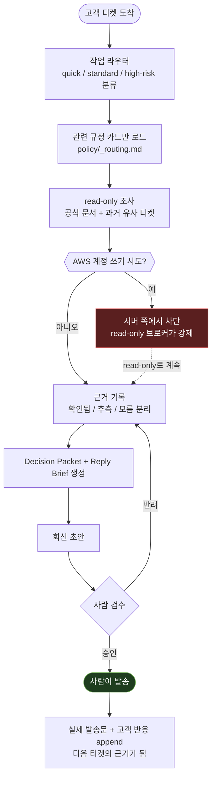

# tiket

고객사 기술 티켓에 AI가 조사·초안을 작성하고, 사람이 검토·발송하는 워크스페이스다.
Claude Code, Codex, Hermes, Kiro 중 무엇을 쓰든 같은 규칙·같은 도구·같은 안전장치 안에서 움직인다.

## 왜 필요한가

AI에게 고객 티켓을 그냥 맡기면 세 가지가 문제가 된다.

- **모르는 걸 아는 것처럼 말한다.** 근거 없이 "RI가 적용됩니다"라고 답했다가 틀리면 신뢰가 깨진다.
- **권한이 실수를 그대로 실행한다.** AI가 실수로 고객 AWS 리소스를 바꾸는 명령을 실행할 수 있다.
- **큰 규정 문서를 매번 통째로 읽는다.** PDF 수백 페이지를 매 티켓마다 다시 훑으면 느리고, 낡은 조항을 그대로 인용하기도 쉽다.

이 저장소는 이 세 가지를 구조로 막는다: 근거 등급을 강제로 나누고, AWS 계정은 서버 쪽에서 쓰기를 차단하고,
필요한 규정 조각만 라우팅해서 불러온다. 아래는 티켓 한 건이 실제로 이 구조를 어떻게 통과하는지다.

## 티켓 한 건의 흐름



굵게 봐야 할 지점 세 곳:

| 지점 | 막는 것 |
|---|---|
| AWS 계정 쓰기 시도 → 차단 | AI 판단이 아니라 **브로커가 서버에서** 강제하는 read-only. AI 실수와 무관하게 안 뚫린다 |
| 근거 기록 | `확인됨`으로 적으려면 실제 공식 문서를 찾아야 한다. 못 찾으면 `추측`/`모름`으로만 남고, 그 상태로는 확정 답변을 못 만든다 |
| 사람 검수 → 발송 | AI는 초안까지만 만든다. 이메일·Zendesk 댓글을 직접 보내는 경로 자체가 없다 |

## 구조

| 위치 | 역할 |
|---|---|
| [`ONBOARDING.md`](ONBOARDING.md) | 신규 엔지니어가 clone부터 첫 연습까지 따라가는 문서 |
| `CLAUDE.md`, `AGENTS.md`, `.kiro/steering/` | 에이전트별 진입점. 내용은 같은 규칙을 가리킨다 |
| `agents/` | 능력 카탈로그, 설치 검증, MCP 설정의 유일한 정본 |
| `customers/` | 고객사 프로필·티켓. clone 직후엔 비어 있고 실제 업무를 하면서 채워진다 |
| `examples/` | 실제 워크플로우를 비식별화해 재구성한 견본 티켓 |
| `policy/` | 대용량 회사 규정의 라우팅·카드·원본 |
| `playbooks/` | 근거 검증, 회신 작성, 인프라 작업, 알려진 함정 |
| `templates/` | 신규 고객·티켓·Decision Packet·Reply Brief 시작점 |
| `handoff/` | 별도 프로젝트에 PoC를 의뢰하고 결과를 받는 창구 |
| `scripts/` | 저장소 구조·보안 경계를 자동 검증하는 도구 |

`customers/`는 빈 폴더로 시작한다. 이 저장소는 사례집이 아니라 워크스페이스라, 티켓을 처리하면서 그때그때 쌓인다.
Git에는 올라가지 않는다(아래 보안 참고) — 엔지니어마다 로컬에 따로 쌓이고, 서로 동기화되지 않는다.

## 시작하기

처음이면 [`ONBOARDING.md`](ONBOARDING.md)부터. clone, 도구 확인, 스킬 설치, 첫 합성 티켓 연습까지 순서대로 있다.

```bash
python3 scripts/validate_workspace.py
```

구조·보안 경계가 정상인지 확인하는 명령이다. `PASS`가 아니면 아래 줄에 뭐가 빠졌는지 나온다.

## 보안 경계 (요약)

- **초안까지만.** 발송·댓글 등록은 사람만 한다.
- **고객 AWS는 read-only.** 계정 역할에 관리자 권한이 있어도 세션은 서버에서 read-only로 강제된다.
- **고객 데이터는 Git에 안 올라간다.** `customers/`는 gitignore + push guard 이중으로 막혀 있다.
- **비용은 FitCloud 정제값만.** AWS 원본 청구 수치를 고객에게 노출하지 않는다.

세부 규칙과 근거는 `CLAUDE.md`, 배포·remote 구성은 `DISTRIBUTION.md`를 따른다.
