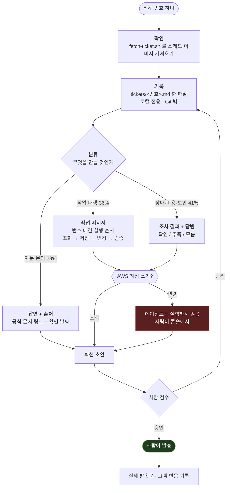

# tiket

고객사 기술 티켓에 AI가 조사·초안을 작성하고, 사람이 검토·발송하는 워크스페이스다.
Claude Code, Codex, Hermes, Kiro 중 무엇을 쓰든 같은 규칙·같은 도구·같은 안전장치 안에서 움직인다.

## 빠른 시작 - QuickStart

**1. 처음 한 번만** — 필요한 구성요소 설치 및 검증

```bash
bash scripts/onboarding.sh          # macOS / Linux
pwsh -File scripts/onboarding.ps1   # Windows
```

> 완벽한 처리를 위해 Zendesk-API-token이 필요합니다

또는 에이전트한테 해달라고 하기
```
온보딩 절차를 보고 검증해줘
```

**2. 에이전트에게 맡기기**

```
티켓 163953 처리해줘 # 확인하고 답변은 사람이 나갑니다
```

---

## 왜 필요한가

AI에게 고객 티켓을 그냥 맡기면 세 가지가 문제가 된다.

- **모르는 걸 아는 것처럼 말한다.** 근거 없이 "RI가 적용됩니다"라고 답했다가 틀리면 신뢰가 깨진다.
- **권한이 실수를 그대로 실행한다.** AI가 실수로 고객 AWS 리소스를 바꾸는 명령을 실행할 수 있다.
- **큰 규정 문서를 매번 통째로 읽는다.** PDF 수백 페이지를 매 티켓마다 다시 훑으면 느리고, 낡은 조항을 그대로 인용하기도 쉽다.

이 저장소는 이 세 가지를 구조로 막는다: 근거에 출처를 강제하고, AWS 계정은 서버 쪽에서 쓰기를 차단하고,
필요한 규정 조각만 라우팅해서 불러온다.

실제로 잡힌 것들이다 — 담당자가 하루 뒤 자체 정정한 잘못된 WAF 룰셋, 존재하지 않는 CLI 명령어,
스크린샷 안에만 있어서 텍스트로는 안 보이던 사실. 아래가 티켓 한 건이 이 구조를 통과하는 순서다.

## 티켓 한 건의 흐름



비율은 실제 티켓 65건을 세어본 값이다 (`design/research/`).

### 왜 산출물을 셋으로 나누나

같은 "답변 초안"이 아니기 때문이다. **작업 대행 건은 고객 회신이 주산출물이 아니다.**
회신은 "설정했습니다" 한 줄이고, 정작 필요한 건 실행자가 그것만 보고 끝낼 수 있는
명령 순서다. 반대로 자문 건은 조회할 리소스가 없어 **틀려도 티가 안 나므로** 출처가
전부다.

형식은 `playbooks/ticket-outputs.md`, 기록 시작점은 `templates/ticket-intake.md`.

### 막는 지점 네 곳


| 지점     | 막는 것                                              |
| ------ | ------------------------------------------------- |
| 근거 등급  | `확인`으로 적으려면 출처가 있어야 한다. **출처 없는 `확인`은 `확인`이 아니다** |
| 문서 충돌  | AWS 문서끼리 어긋나면 조용히 한쪽을 고르지 않고 충돌을 기록한다             |
| AWS 쓰기 | 브로커가 **서버에서** read-only를 강제한다. AI 실수와 무관하게 안 뚫린다  |
| 사람 검수  | 이메일·Zendesk 댓글을 AI가 직접 보내는 경로 자체가 없다              |


## 구조


| 위치                                          | 역할                                        |
| ------------------------------------------- | ----------------------------------------- |
| [`ONBOARDING.md`](ONBOARDING.md)            | 신규 엔지니어가 clone부터 첫 연습까지 따라가는 문서           |
| [`TECHNICAL.md`](TECHNICAL.md)              | **각 디렉터리가 언제 로드되고 어떻게 쌓이는지** — 구조 해설      |
| `CLAUDE.md`, `AGENTS.md`, `.kiro/steering/` | 에이전트별 진입점. 내용은 같은 규칙을 가리킨다                |
| `agents/`                                   | 능력 카탈로그, 설치 검증, MCP 설정의 유일한 정본            |
| `tickets/`                                  | 티켓 처리 기록. 티켓 하나당 파일 하나. **Git에 올라가지 않는다** |
| `customers/`                                | 고객사 계약·청구·담당자 프로필. 필요할 때만 만든다             |
| `policy/`                                   | 대용량 회사 규정의 라우팅·카드·원본                      |
| `playbooks/`                                | **산출물 3종 형식**, 근거 검증, 회신 작성, 알려진 함정       |
| `templates/`                                | 티켓 기록·고객 프로필 시작점                          |
| `handoff/`                                  | 별도 프로젝트에 PoC를 의뢰하고 결과를 받는 창구              |
| `scripts/`                                  | 온보딩, 티켓 가져오기, 저장소·보안 경계 자동 검증             |
| `design/`                                   | **이 프레임워크를 왜 이렇게 만들었는지** — 결정·버린 선택지·실측   |


`tickets/` 와 `customers/` 는 **빈 채로 시작한다.** 이 저장소는 사례집이 아니라 워크스페이스라,
티켓을 처리하면서 그때그때 쌓인다. 둘 다 Git에 올라가지 않는다(아래 보안 참고) — 엔지니어마다
로컬에 따로 쌓이고 서로 동기화되지 않는다.

## 보안 경계 (요약)

- **초안까지만.** 발송·댓글 등록은 사람만 한다.
- **고객 AWS는 read-only.** 계정 역할에 관리자 권한이 있어도 세션은 서버에서 read-only로 강제된다.
- **고객 데이터는 Git에 안 올라간다.** `tickets/` 와 `customers/` 는 gitignore + push guard 이중으로 막혀 있고, 강제 추가해도 push 단계에서 걸린다.
- **비용은 FitCloud 정제값만.** AWS 원본 청구 수치를 고객에게 노출하지 않는다.

세부 규칙은 `CLAUDE.md`, 배포·remote 구성은 `DISTRIBUTION.md`, 신규 엔지니어는
[`ONBOARDING.md`](ONBOARDING.md) 를 따른다. 각 디렉터리가 실제로 어떻게 동작하는지는
[`TECHNICAL.md`](TECHNICAL.md) 에 있다.